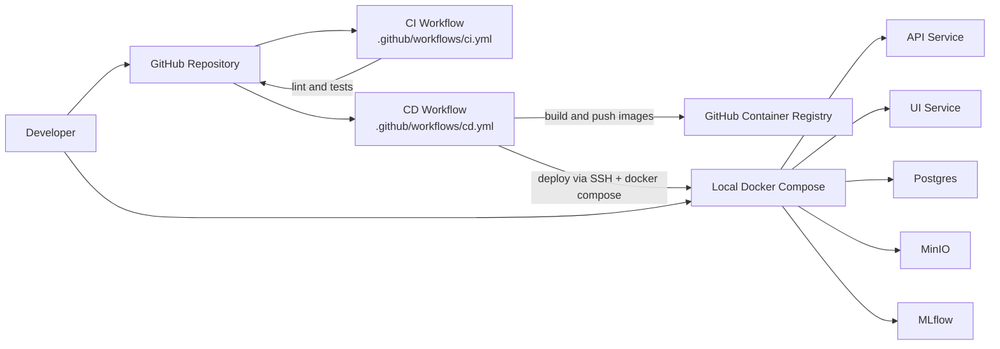

# V2AI Architectural Diagram

This document captures the current end-to-end architecture flow of the V2AI project.

## 1. End-to-End Application Flow

```mermaid
flowchart TD
    U[User Browser]
    UI[src/ui/streamlit_app.py]
    API[src/app/api/main.py]
    SVC[src/app/services/video_pipeline_service.py]

    U --> UI
    UI -->|POST /upload-video| API
    UI -->|POST /upload-video-url| API
    UI -->|POST /ask| API

    API --> SVC

    subgraph Ingestion[Ingestion and Processing]
        YDL[yt-dlp URL download]
        PRE[Save local video]
        STT[Whisper transcription]
        SUM[Transcript summarization]
        CON[Concept extraction]
        STUDY[Flashcards and quiz generation]
        CHUNK[Segment to document chunks]
        VEC[FAISS index build per session]
    end

    SVC --> YDL
    SVC --> PRE --> STT --> SUM --> CON --> STUDY --> CHUNK --> VEC

    subgraph Retrieval[Question Answering with Context]
        LOAD[Load session FAISS index]
        RET[Top-k retrieval]
        PROMPT[Context prompt assembly]
        GEN[HF generation model]
        CLEAN[Answer cleanup and dedupe]
        CITE[Timestamp citations]
    end

    SVC --> LOAD --> RET --> PROMPT --> GEN --> CLEAN --> CITE

    subgraph Persistence[Storage and Session State]
        SQL[(PostgreSQL or SQLite)]
        ART[artifacts/uploads, transcripts, vectorstore]
        MINIO[(MinIO object storage)]
    end

    SVC --> SQL
    SVC --> ART
    SVC --> MINIO

    subgraph Monitoring[Monitoring and Tracking]
        REQLOG[Request logger]
        DRIFT[Drift checker]
        MLF[MLflow tracker]
        WDB[WandB tracker optional]
        METRICS[/metrics Prometheus endpoint]
    end

    API --> REQLOG
    API --> MLF
    API --> METRICS
    REQLOG --> DRIFT
    MLF --> MLR[(mlruns or MLflow server)]
    WDB -.optional.-> WANDB[(Weights and Biases)]

    subgraph Experiments[Evaluation and Versioning]
        EVAL[src/app/experiments/evaluate_rag.py]
        REG[src/app/experiments/register_model.py]
        RUN[scripts/run_full_pipeline.py]
        CLEANUP[scripts/cleanup_sessions.py]
    end

    RUN --> EVAL
    RUN --> REG
    RUN --> DRIFT
    CLEANUP --> SQL
    CLEANUP --> ART
```

## 2. Deployment and DevOps Flow



## 3. Notes

- Upload supports local video files and YouTube links.
- Session-specific vector indexes are created during upload processing.
- Answers are grounded in retrieved transcript context and returned with timestamp citations.
- Tracking and monitoring are integrated through request logs, Prometheus metrics, and MLflow.
